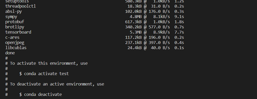

============
Installation
============

All of our source code has been tested with Python 3.9/3.10 on both Windows 10/11 and Ubuntu 20.04. You can either use git clone to obtain our code or directly download the zip file from our GitHub project page. Here, we demonstrate both approaches using Visual Studio Code (VSCode).

Clone the code
--------------

- **Installation method 1**
  
  Open Visual Studio Code (VSCode) and create a new folder. To clone the GitHub repository, use the following command:

  .. code-block:: bash

      git clone https://github.com/RegiusQuant/ESIDLM.git

  .. figure:: ../images/sopinet-tutorial-1.png
    :alt: sopinet tutorial 1.png
    :align: center

- **Installation method 2**

  Download the zip file to your local at our project homepage (`https://github.com/RegiusQuant/ESIDLM <https://github.com/RegiusQuant/ESIDLM>`_) and unzip to the folder where you want.

  .. figure:: ../images/sopinet-tutorial-2.jpg
    :alt: sopinet tutorial 2.png
    :align: center

Build the required environment
------------------------------

We have listed all the required packages for our model in the *environment.yml* file. You can either configure them one by one in your existing environment or create a new environment automatically using conda (recommended). In this guide, we demonstrate the latter approach.

- **Setting environment method 1**  
  First, navigate to the created folder and use the following code to build the required Python packages (please note that you should have conda software installed beforehand). You can also customize the name of your environment by replacing *myenv* with your desired name.

  .. code-block:: bash

      conda env create -f environment.yaml --name myenv

- **Setting environment method 2**  
  Additionally, we recommend using Mamba-forge in our tutorials. It helps to speed up the installation process and improve installation stability. To install Mamba, use the following command:

  .. code-block:: bash

      conda install mamba -n base -c conda-forge

  Next, the installation command is the same as for conda; simply replace 'conda' with 'mamba', as illustrated below:

  .. code-block:: bash

      mamba env create -f environment.yaml --name myenv

When the environment is established successfully, you will see the following figure.

