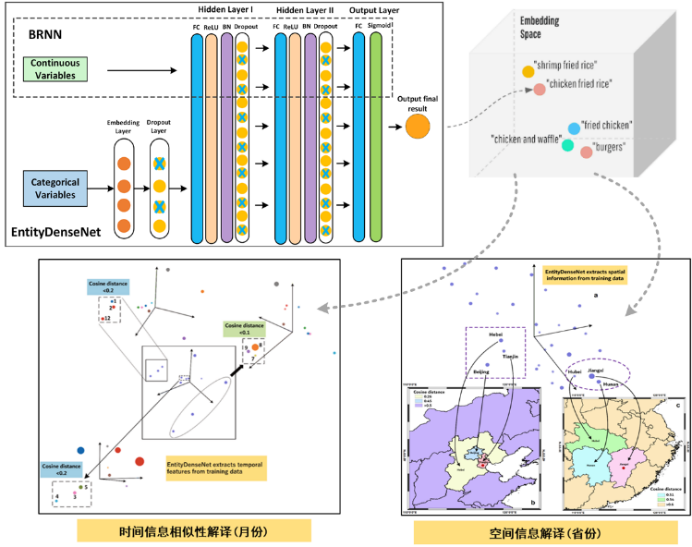
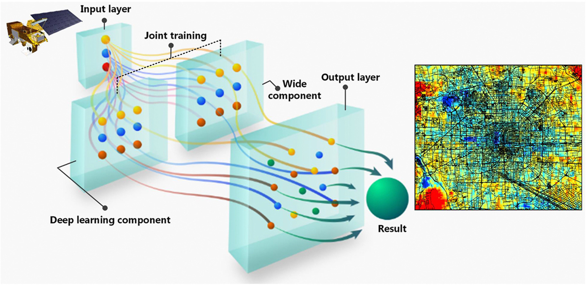
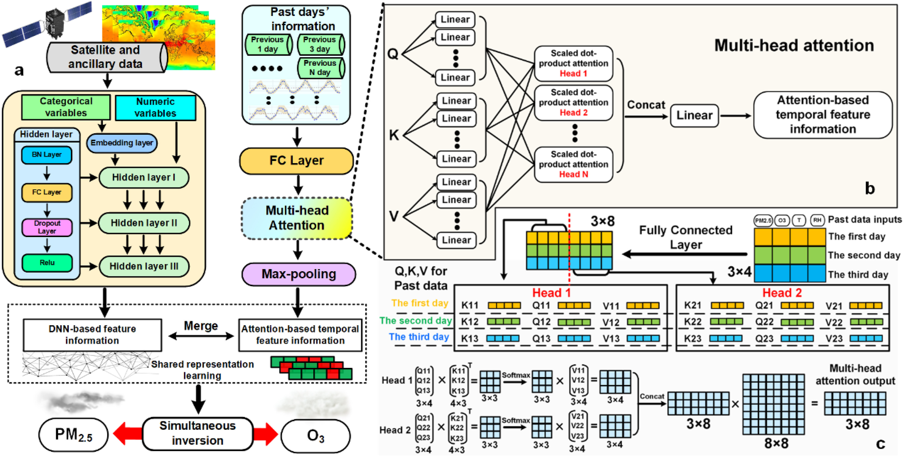

============
Introduction
============

ESIDLM (Enhanced Spatial-Temporal Interpretable Deep Learning Model) is a Python package developed and maintained by Dr. Yan Xing's team at Beijing Normal University `(Home Page) <https://gcess.bnu.edu.cn/yjspy/dsjj/157170.html>`_. Currently, ESIDLM has integrated a variety of advanced deep learning models, as follows. If you have any questions, please contact yanxing@bnu.edu.cn.

EntityDenseNet
--------------

EntityDenseNet is a deep learning model based on deep neural networks (DNN) that enhances interpretability by combining embedding techniques and UMAP (Uniform Manifold Approximation and Projection).

SIDLMNet
--------

SIDLMNet, a novel Spatial-Temporal Interpretable Deep Learning Model (SIDLM), integrates both linear (Wide) and non-linear (Deep) models while employing a joint training approach to enhance interpretability and predictive accuracy.

SOPINet
-------

SOPINet is an advanced multi-tasking model that leverages DNN-based models and Transformer architecture, capable of simultaneously retrieving PM2.5 and Ozone levels.

