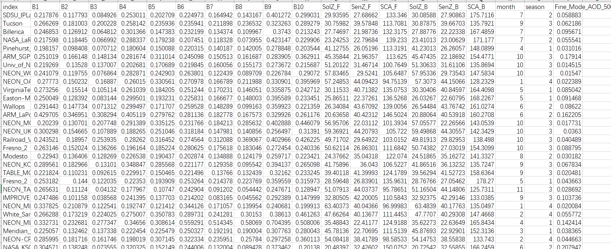
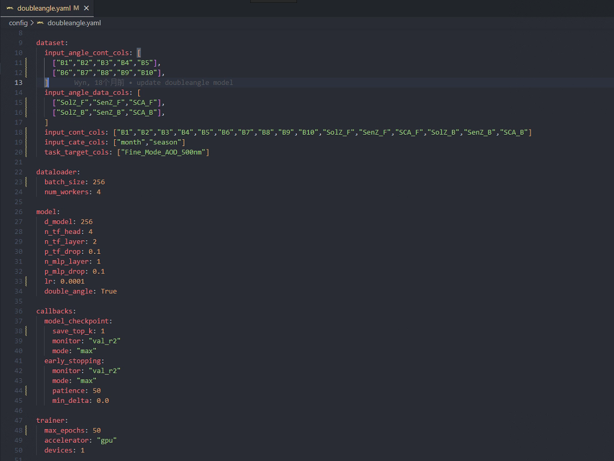
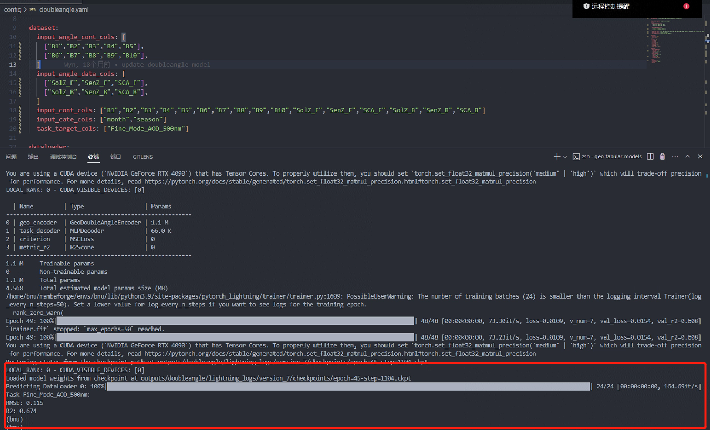

==================
ADLM QuickStart
==================

Example Data Link: `https://github.com/Zc-1999/Angle-Dependent-Deep-Learning-Model-ADLM/tree/main/example`

Data format
-----------

labeled data
++++++++++++

The first part is the labeled data for modeling, which should be in .csv format and named as train.csv, valid.csv, and test.csv for training, validation, and testing data, respectively.

The format within each .csv file should adhere to the following structure.B1-B5 refers to the forward band data of the satellite, and B6-B10 refers to the backward band data of the satellite.SolZ_F,SenZ_F,SCA_F indicates the forward Angle data of the satellite, and SolZ_B, SenZ_B, SCA_B, indicates the backward Angle data of the satellite The primary data structure is as follows:

Parameter Configuration
-----------------------

Once you have completed the installation of the model, you will find the following main folders in the project: adlm, examples, and outputs. All the code is encapsulated within the adlm folder, and we do not recommend modifying the code in this folder. In the examples folder, we have uploaded a small subset of train/valid/test data and we configure the model parameters through yaml file. Next, We will provide a brief explanation of the modifications you need to make locally in the API.

Training the model
----------------------

Here, we demonstrate a complete training process using example train data. First, open the ADLM project and make sure you have the suitable python environment.Then,set the appropriate parameters according to our api tutorial adjustment. In this example, we set the following parameters.

Run the model by calling the yaml file with cmd, where the call command is `` python main.py -t doubleangle -c config/doubleangle.yaml `` .The model then works and the test results appear on the command line. In addition, the specific results will be output to the output file you set in the parameter configuration.In our example, the final model has an accuracy R2 of 0.674 on the test dataset.

