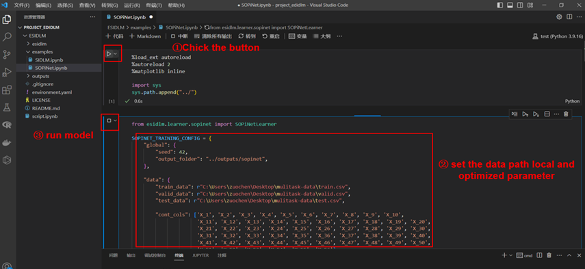
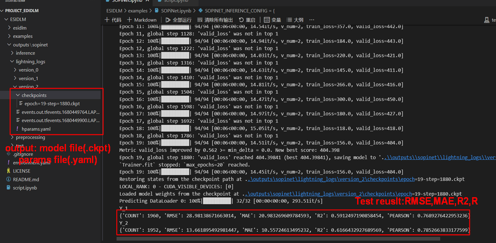
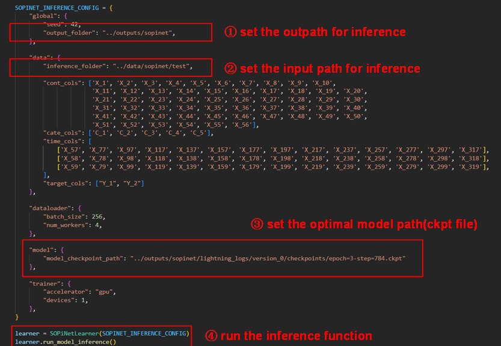

==================
SOPINet QuickStart
==================

Example Data Link: `https://zenodo.org/record/7815394 <https://zenodo.org/record/7815394>`_

Data preprocessing
----------------------

The data used for SOPiNet consists of two parts:

labeled data
++++++++++++

The first part is the labeled data for modeling, which should be in .csv format and named as train.csv, valid.csv, and test.csv for training, validation, and testing data, respectively.

unlabeled data
++++++++++++++

The second part is the unlabeled data for retrieving PM2.5 and Ozone levels from the full image. This data can be in .csv format with any name, typically named according to its date

The format within each .csv file should adhere to the following structure. To clarify the data structure, we designate continuous variables to start with ``X_*``, where * should be a sequential number. Categorical variables should start with ``C_*``, where * should also be a sequential number. For the labeled data, it should contain both PM2.5 and Ozone in-situ measurements for training, and we default these to Y_1 and Y_2. Moreover, to utilize more training samples, we use mask columns to address the absence of observations at certain sites. The primary data structure is as follows:

Parameter Configuration
--------------------------

Once you have completed the installation of the model, you will find the following main folders in the project: esidlm, examples, and outputs. All the code is encapsulated within the esidlm folder, and we do not recommend modifying the code in this folder. In the examples folder, we have uploaded a small subset of train/valid/test data, and the "SOPiNet.ipynb" file demonstrates how to use the esidlm module with a specific example. You only need to adjust some simple parameter configurations and run each cell in the Jupyter notebook in sequence to build your own model. To simplify usage, we have consolidated all configurations into a dictionary variable called ``SOPINET_TRAINING_CONFIG``. We will provide a brief explanation of the modifications you need to make locally in the API.

Training the model
----------------------

Here, we demonstrate a complete training process using example train data. First, open the ESIDLM project and update the system path using the 'sys' module (in the first code cell). Next, set your own data path and optimization parameters. After configuring the parameters appropriately, create a ``SOPiNetLearner`` object and invoke the ``run_model_training`` function.

In this instance, we set the parameters as follows: "batch_size": 64, "d_embed": 32, "d_model": 128, "n_layers": 1, "n_head": 4, and "p_drop": 0.1. As you can see, after just 20 epochs of training (taking about 2 minutes), we have achieved remarkable accuracy with an R2 of 0.59 for PM2.5 (Y_1) and 0.61 for ozone (Y_2). At this point, a full round of model training is complete, and the remaining task is to fine-tune the parameters and optimize the model further.

It should be emphasized that both each training of the model and Hyperparameter file are saved in the output folder (default=’ /.. /outputs/sopinet’).

Using model Inference
------------------------

Once you have determined the best optimized model, it can be used for inference. You should configure the dictionary named ``SOPINET_INFERENCE_CONFIG``, which is quite similar to the training model. First, set the input and output folders, ensuring that the input data is unlabeled. Then, set the optimal model path and execute the inference function.

